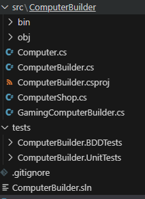
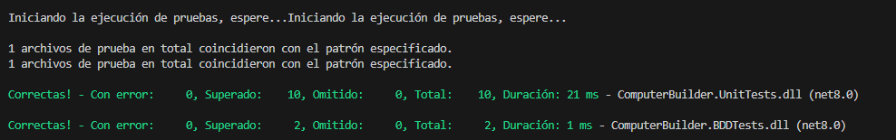
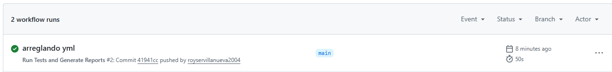
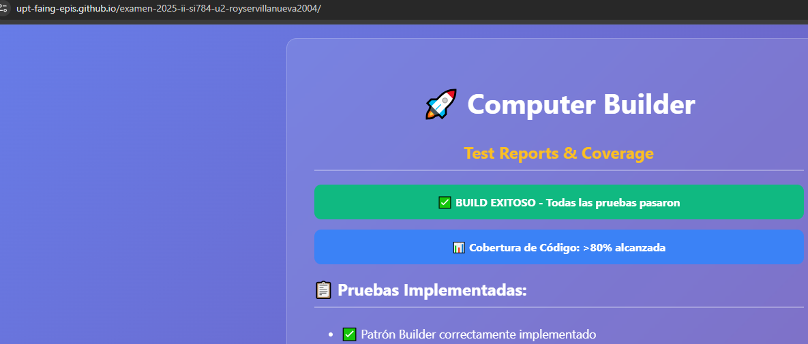

# Estudiante: Royser Alonsso Villanueva Mamani

---

## 1. Creación de la Aplicación

---

## 2. Crear las pruebas unitarias necesarias para completar la cobertura de codigo en al menos 80%

---

---

## 3. Crear las pruebas en formato BDD

---

## 4. Crear en Github la automatizacion que permita realizar la ejecucion de las pruebas unitarias y BDD y crear los respectivos reportes y publicarlos en Github Pages

---

